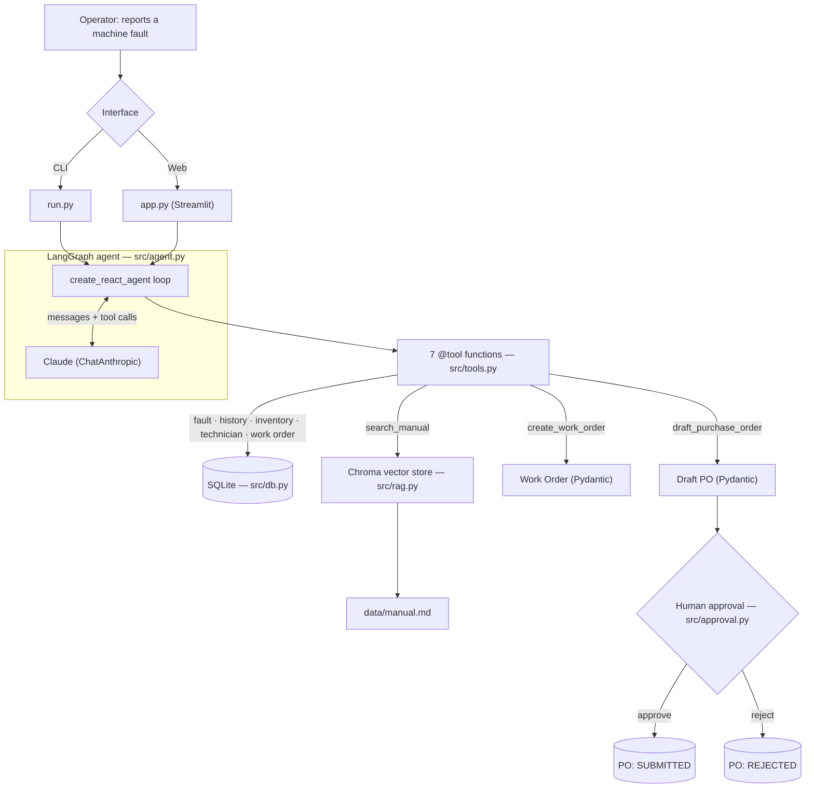
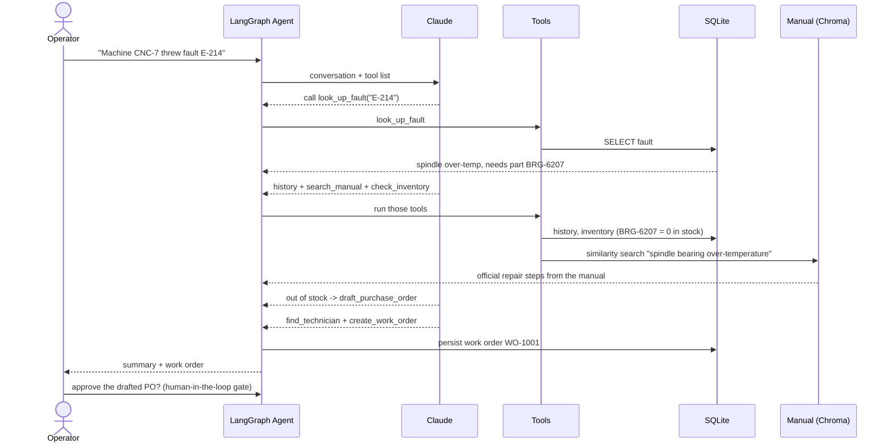

# Architecture

A maintenance / downtime-resolution **agent**: an operator reports a machine
fault in plain English, and the agent diagnoses it, grounds the fix in the
equipment manual, checks parts, drafts a purchase order if needed, assigns a
technician, and produces a work order — using tools, not guesses. Any purchase
order is held for **human approval** before it is "submitted."

## System diagram

## Request flow (one fault, end to end)

## Components

| Module | Responsibility | Key tech |
|---|---|---|
| `run.py` | CLI entry point; runs the agent, then the approval gate | — |
| `app.py` | Streamlit web UI; Approve/Reject PO buttons | Streamlit |
| `src/agent.py` | Builds the agent loop (think → call tool → observe → repeat) | LangGraph `create_react_agent`, `ChatAnthropic` |
| `src/tools.py` | The 7 tools the agent can call | LangChain `@tool` |
| `src/rag.py` | Chunk → embed → store → retrieve the manual | Chroma + local embeddings |
| `src/db.py` | Persistence + queries | SQLite (stdlib) |
| `src/models.py` | Output schemas (WorkOrder, PurchaseOrder) | Pydantic |
| `src/approval.py` | Human-in-the-loop PO approval | plain Python (no LLM) |
| `src/config.py` | Loads `.env`, selects the model | python-dotenv |
| `data/seed.py` | Synthetic plant data (seeds the DB) | — |
| `data/manual.md` | Equipment manual (the RAG corpus) | — |

## The 7 tools

`look_up_fault` · `get_fault_history` · `search_manual` (RAG) ·
`check_inventory` · `draft_purchase_order` · `find_technician` ·
`create_work_order`

## Data model (SQLite)

| Table | Columns |
|---|---|
| `faults` | code, description, likely_cause, recommended_part, skill_needed |
| `inventory` | part_number, name, qty, supplier, unit_cost |
| `history` | id, machine_id, fault_code, date, resolution |
| `technicians` | id, name, skills (JSON), next_slot |
| `work_orders` | work_order_id, payload (JSON) |
| `purchase_orders` | id, payload (JSON), status |

## Design principle: AI for judgment, code for everything else

| Done by **Claude** (judgment / language) | Done by **deterministic code** |
|---|---|
| Diagnose the fault, decide which tools to call | DB lookups (faults, inventory, history) |
| Write the repair procedure from the manual | Purchase-order math (qty × unit cost) |
| Summarize the resolution for the operator | The human-approval gate (no LLM) |
| | Persisting work orders + POs |

This keeps the unpredictable part (the LLM) out of money-touching and
state-changing paths: the agent **drafts**, deterministic code and a human
**decide and commit**.

## Tech stack

Python 3.9 · LangGraph 0.6.11 · LangChain 0.3.30 / langchain-anthropic 0.3.22 ·
Claude (`claude-haiku-4-5` dev / `claude-opus-4-8` prod) · Chroma 1.5.9 ·
SQLite (stdlib) · Pydantic 2.13.4 · Streamlit 1.50.0 · pytest 8.4.2

## Limitations

Synthetic data and a sample manual; no real CMMS/ERP integration, no auth, no
multi-tenant. The approval gate currently runs in the CLI/UI, not as a durable
queue.
